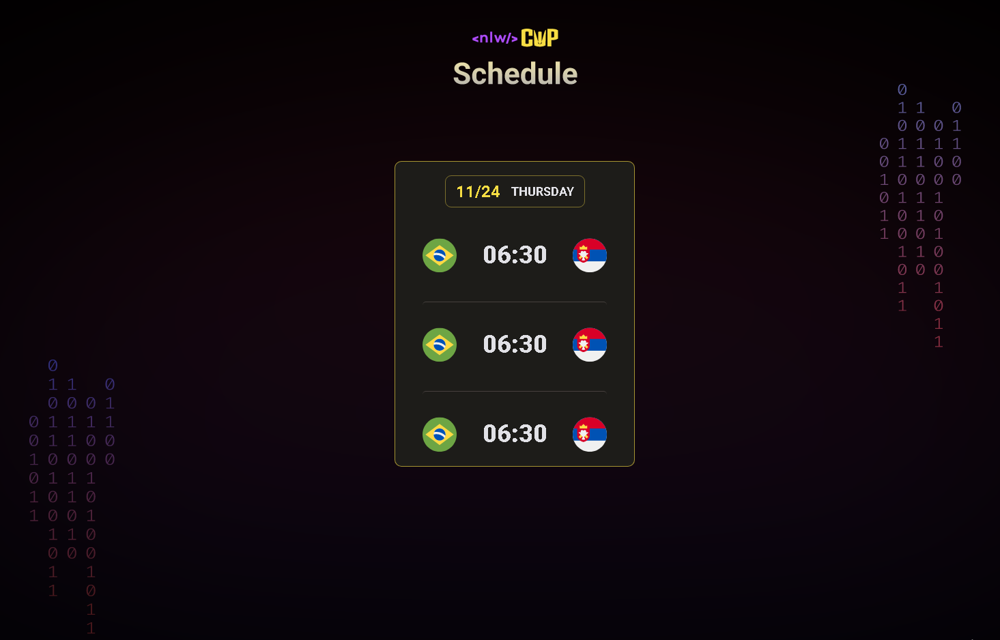
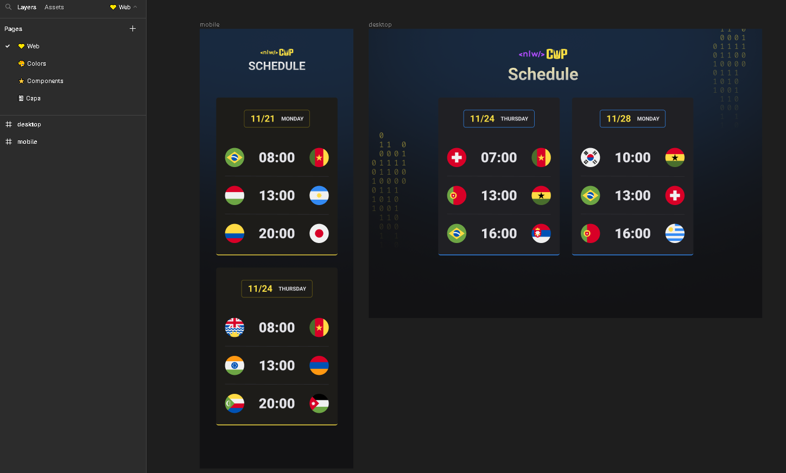

# World Cup Schedule - 2022 
  
[Project](#sparkles-project) | [Layout](#sunrise-layout) | [Technologies](#computer-technologies)

________

## :sparkles: Project
With this small project you can see the date and time of the world cup matches.  
[*Not finished yet*]

  

 

## :sunrise: Layout 
All icons, images, backgrounds, logos you can take <a href="https://www.figma.com/file/NNWTIgAsceT5Kjtu9HdHlr/Calend%C3%A1rio-de-Jogos-(Community)?node-id=0%3A1">here</a>. You have to create an account on Figma if you want to save files and modify the layout (font, color, size..).  

  

 

## :computer: Technologies
[HTML5](https://img.shields.io/badge/html5-%23E34F26.svg?style=for-the-badge&logo=html5&logoColor=white)  
[CSS3](https://img.shields.io/badge/css3-%231572B6.svg?style=for-the-badge&logo=css3&logoColor=white)  
[JavaScript](https://img.shields.io/badge/javascript-%23323330.svg?style=for-the-badge&logo=javascript&logoColor=%23F7DF1E)  
